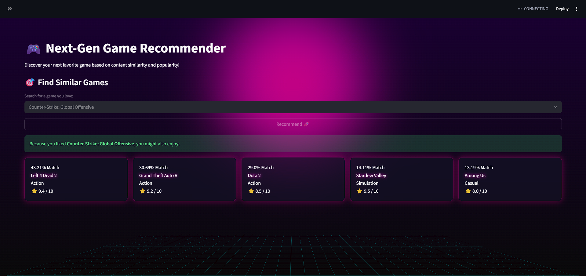

# 🎮 Game Recommendation System

🚀 A Machine Learning-based Game Recommendation System that suggests similar games using **content-based filtering**.

---

## 📸 Project Preview

<p align="center">
  
</p>

---

## 📌 Overview

This project recommends games similar to a selected game by analyzing features like **genre** and **tags**.

It uses:

* **TF-IDF (Term Frequency - Inverse Document Frequency)**
* **Cosine Similarity**

to calculate similarity between games and generate recommendations.

Additionally, it also shows **top-rated trending games**, making it a hybrid recommendation system.

---

## 🧠 Features

* 🎯 Content-Based Recommendation System
* 🔍 TF-IDF + Cosine Similarity
* 🎮 Interactive UI using Streamlit
* 🔥 Trending / Top-rated games section
* ⚡ Fast and efficient

---

## 🛠️ Tech Stack

* Python 🐍
* Pandas & NumPy
* Scikit-learn
* Streamlit

---

## 📂 Project Structure

```bash
game-recommender/
│── data/
│    └── games.csv
│
│── assets/
│    └── game-view.png
│
│── src/
│    ├── preprocess.py
│    ├── model.py
│
│── app.py
│── requirements.txt
```

---

## ⚙️ How It Works

1. Load dataset and preprocess data
2. Combine genre and tags into a single feature column
3. Convert text into vectors using TF-IDF
4. Compute similarity using cosine similarity
5. Recommend top similar games based on user input
6. Display trending games based on ratings

---

## ▶️ How to Run

### 1. Clone the repository

```bash
git clone https://github.com/your-username/game-recommender.git
cd game-recommender
```

### 2. Install dependencies

```bash
pip install -r requirements.txt
```

### 3. Run the app

```bash
streamlit run app.py
```

---

## 📊 Example Usage

* Select a game from dropdown
* Click **Recommend**
* Get top 5 similar games
* View top-rated trending games

---

## 🚀 Future Improvements

* 🔄 Collaborative Filtering
* 🌐 Live Game API integration
* 🖼️ Game posters & images
* ☁️ Deployment (AWS / GCP / Streamlit Cloud)
* 🔍 Smart search system

---

## 💡 Learning Outcomes

* Built a real-world recommendation system
* Learned TF-IDF and similarity metrics
* Developed an interactive ML web app
* Understood end-to-end ML workflow

---

## ⭐ Support

If you like this project, consider giving it a ⭐ on GitHub!
